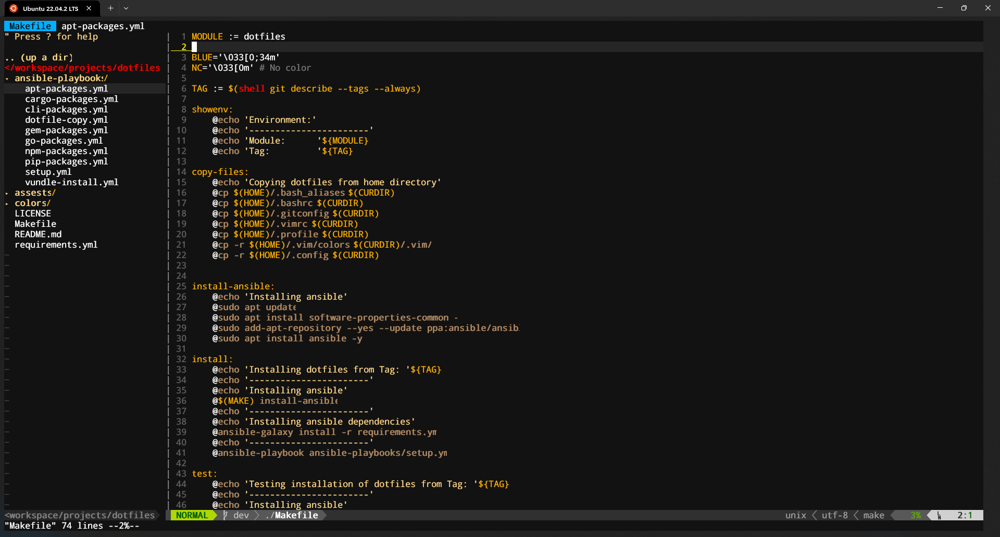

# dotfiles [](https://github.com/DMcP89/dotfiles/actions/workflows/run-test.yml)
Repository of configuration files for setting up my development environment. Using a combination of bash scripts and ansible playbooks the process of getting an environment setup is almost completely automated.




## Compatible OSs
* Ubuntu 20.04 LTS
* WSL Ubuntu 20.04 LTS
* Ubuntu 22.04 LTS
* WSL Ubuntu 22.04 LTS

## Setup
1. Clone this repository
```
git clone https://github.com/DMcP89/dotfiles.git
```
2. Run make install
```
# if you've set your become password in ansible.cfg you can run
make install

# if you haven't set your become password in ansible.cfg you can run
make local-install
```


## Features
### Powerline
I use powerline for my terminal prompt. I have a simple setup that will display the following information from left to right:
* Hostname (Only while connected via SSH)
* Username
* Battery Status (Only if on a laptop)
* Current date-time
* Active virtual environment (Only if in a virtual environment)
* Current working directory
* Git branch and status (Only if in a git repository)

### VIM
A relatively simple vim configuration that uses the powerline plugin to display a status bar, nerdtree for file tree navigation, and a few other features.

*Plugins*
* [Vundle](https://github.com/VundleVim/Vundle.vim)
* [nerdtree](https://github.com/preservim/nerdtree)
* [vim-buftabline](https://github.com/ap/vim-buftabline)
* [pylint](https://github.com/vim-scripts/pylint.vim)
* [vim-fugitive](https://github.com/tpope/vim-fugitive)
* [vim-go](https://github.com/fatih/vim-go)

*Color Schemes*
* [badwolf](https://github.com/sjl/badwolf)

### Ruby
* [mdless](https://github.com/ttscoff/mdless) is a gem that allows you to display markdown in your terminal.

### NodeJS
* [Nvm](https://github.com/nvm-sh/nvm) is a node version manager that allows you to install and manage multiple versions of node.

### Python
* [Poetry](https://github.com/python-poetry/poetry) helps you declare, manage and install dependencies of Python projects, ensuring you have the right stack everywhere.

* [Pyenv](https://github.com/pyenv/pyenv) lets you easily switch between multiple versions of Python. It's simple, unobtrusive, and follows the UNIX tradition of single-purpose tools that do one thing well.

* [Pyenv-virtualenv](https://github.com/pyenv/pyenv-virtualenv) is a plugin for Pyenv that allows you to create and manage virtual environments.

### Go
* Installs latest version of Go

### Rust
* [Ttyper](https://github.com/max-niederman/ttyper) is a command line tool that allows you to practice typing in your terminal.

### CLI Tools
* AWS CLI
* Azure CLI
* GCP CLI
* Helm
* Kubectl
* Terraform
* Docker